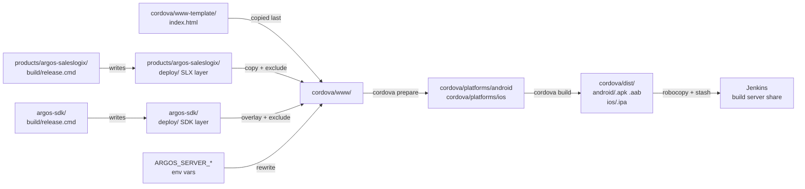
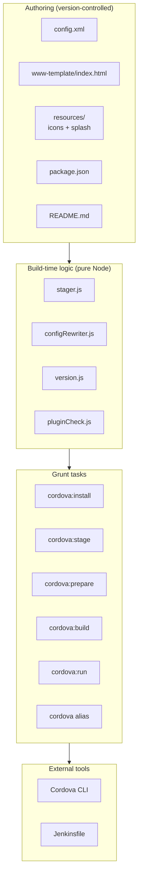

# Design Document

## Overview

This design wraps the existing Argos SalesLogix mobile web application in an Apache Cordova native shell so the same bits that ship to IIS can be packaged as installable Android and iOS applications. The Cordova project lives entirely under `cordova/` at the monorepo root (sibling to `argos-sdk/`, `products/`, `packages/`, and `tests/`) and is driven by a new `grunt cordova` task pipeline rooted in `cordova/Gruntfile.js`. The web build (`build/release.cmd` and the existing `grunt bundle` / `grunt lang-pack` tasks) is untouched: Cordova consumes both `products/argos-saleslogix/deploy/` (the SLX layer) and `argos-sdk/deploy/` (the SDK layer) as read-only inputs and produces native artifacts in a parallel output directory under `cordova/dist/`. The compiled web app is the overlay of those two deploy folders — the SLX layer provides `argos-saleslogix.js`, `dojo-dependencies.js`, `configuration/`, `localization/`, and `help/`, while the SDK layer provides `argos-sdk.js`, `argos-dependencies.js`, `argos-amd-dependencies.js`, the Dojo core, cultures, and CSS themes. This mirrors the production IIS deploy, which unstashes `slx` then `sdk` into the same directory; staging only the SLX layer produces a blank page because the SDK / Dojo `<script>` tags never resolve.

The design partitions the work into three concerns:

1. **Authoring assets** — `config.xml`, the entry template (`cordova/www-template/index.html`), platform resources (icons, splash images), `package.json`, and a `README.md`. These live under version control and define the shape of the native shell.
2. **Build-time logic** — a small set of pure Node helpers (Stager, Config Rewriter, Version Resolver) wrapped by Grunt tasks. These are the only pieces with non-trivial behavior we control, and they are the focus of automated testing.
3. **Tool integration** — the Apache Cordova CLI (`cordova prepare`, `cordova build`, `cordova run`) and the Jenkins pipeline. We wrap the CLI through `grunt-shell` and add a single Jenkins stage that follows the existing `Creating bundles` stage.

The shell itself runs the unmodified `crm/Bootstrap` flow inside the Cordova WebView. The only application-visible difference between web and native execution is that the entry template defers `crm/Bootstrap` until the Cordova `deviceready` event has fired (with a 10 s fallback so the same `index.html` can be opened in a desktop browser for diagnostics) and that runtime configuration is read from explicit values in `configuration/production.js` rather than from `window.location` (which resolves to the local file origin under Cordova).

### Goals

- Reuse the compiled web application byte-for-byte; never modify `deploy/`.
- Express the Cordova-specific bootstrap as a single small delta on top of the current `index.html`, using a version-controlled template rather than the stale `index-phonegap.html`.
- Keep all interaction with the Cordova CLI behind Grunt tasks so Jenkins, developers, and future CI hosts use the same entry points.
- Pin every Cordova platform and plugin to an exact version so build reproducibility does not depend on npm range resolution.
- Fail fast and loud in the Stager and Build tasks — missing `deploy/`, malformed environment overrides, or missing signing secrets must produce a non-zero exit and a named cause.

### Non-Goals

- Modifying or restructuring the web application code under `src/`.
- Replacing the existing Grunt + JsBit pipeline.
- Supporting platforms beyond Android and iOS (Windows UWP, Electron, browser platform are explicitly excluded).
- Submitting to public app stores in this iteration; the focus is enterprise MDM distribution. App Store / Play Store submission imposes additional review and asset requirements that are out of scope.

## Architecture

### High-Level Build Flow



### Process Layout

The Cordova shell layers four conceptual stages on top of the web build:

| Stage | Grunt task | Reads | Writes | Cordova CLI? |
|-------|------------|-------|--------|--------------|
| Install | `cordova:install` | `cordova/package.json` | `cordova/node_modules/` | no |
| Stage | `cordova:stage` | `products/argos-saleslogix/deploy/`, `cordova/www-template/`, env vars | `cordova/www/` | no |
| Prepare | `cordova:prepare` | `cordova/www/`, `cordova/config.xml` | `cordova/platforms/` | yes |
| Build | `cordova:build:<target>:<profile>` | `cordova/platforms/`, signing env vars | `cordova/dist/` | yes |

Each stage is independently invokable. The `cordova` alias task is `cordova:install` then `cordova:stage` then `cordova:prepare` then `cordova:build:all:release`. Jenkins invokes the alias; developers usually invoke `cordova:run:android` or `cordova:run:ios` (Stage + `cordova run`) to skip artifact production.

### Component Boundaries



The Authoring layer is content. The Build Logic layer holds all the testable behavior we own. The Grunt Tasks layer is a thin adapter that wires the helpers and the Cordova CLI together.

### Why a New Entry Template Instead of `index-phonegap.html`

The legacy `products/argos-saleslogix/index-phonegap.html` cannot be reused. It declares an inline `dojoConfig` shim that the modern `index.html` removed, references a `localization/en` legacy path that no longer exists, omits the `icboe` and `contour` locale files the current bootstrap loads, and places `<body>` outside `<head>` improperly. It is also not copied into `deploy/` by `build/release.cmd`. Reviving it would amount to porting it forward, after which it would diverge again on the next bootstrap change.

Instead, the Cordova shell ships its own version-controlled entry template at `cordova/www-template/index.html` that mirrors the bootstrap shape of `products/argos-saleslogix/index.html` exactly and adds one localized delta: a `<script src="cordova.js">` tag and a `deviceready` listener wrapped around the existing `require(['crm/polyfills/index', 'crm/Bootstrap'], ...)` invocation. The template is copied verbatim into `cordova/www/index.html` as the last step of staging, after `deploy/` has been mirrored, so the staged web `index.html` is overwritten in place.

When the bootstrap shape changes in the web build, the template must be updated alongside it. A documentation note in `cordova/README.md` and a comment block at the top of the template will record this contract.

### Configuration Model

`configuration/production.js` (compiled into `products/argos-saleslogix/deploy/configuration/`) is the single source of truth for runtime SData server settings. The current production default reads `serverName`, `port`, and `protocol` from `window.location`, which is correct for an IIS-hosted web build but produces a `file://` host inside Cordova. The Stager addresses this by overwriting fields in the staged copy with explicit string values when `ARGOS_SERVER_*` environment variables are present. When no overrides are set, the Stager leaves the file untouched; the runtime then sees the same fallback the web build does, which is fine for diagnostic builds run in a desktop browser but means a Cordova binary built without overrides will not have a working SData host. The README documents this and the build pipeline always sets the variables for release builds.

A `release` Build Profile copies `configuration/production.js` from `products/argos-saleslogix/deploy/`. A `debug` Build Profile copies `configuration/development.js` from `products/argos-saleslogix/deploy/` and writes it to `cordova/www/configuration/production.js` so the AMD module path `configuration/production` resolves to the development content without changing the entry template.

### Authentication and Mingle Redirect

The native shell preserves the current Mingle SSO flow with one mobile-specific addition. Mingle's authorization redirect URL becomes a custom URL scheme `infor-crm-slx://oauth/callback` registered through the Cordova app, and the OAuth dance happens inside `cordova-plugin-inappbrowser`. The shell intercepts navigations on the in-app browser, extracts `access_token` and `expires_in` from the redirect URL, closes the browser, and forwards the token to the existing `crm/MingleUtility.populateAccessToken` entry point. The existing Argos token storage (`localStorage`) and refresh logic are unchanged.

The custom URL scheme requires Mingle tenant configuration to add `infor-crm-slx://oauth/callback` as an authorized redirect URL. This is a one-time tenant setup, documented in `cordova/README.md`.

### Pinning Strategy

Every Cordova platform and every plugin in Plugin_Set is pinned to an exact `MAJOR.MINOR.PATCH` version in `cordova/package.json`. No range operators (`^`, `~`, `>`, `<`, `>=`, `<=`, `*`) are permitted. A small validation helper (`pluginCheck.js`) cross-references `package.json` against `config.xml` and fails the `cordova:build` task with a named missing plugin if either file is missing a declaration that appears in the other.

## Components and Interfaces

### Directory Layout

```
<monorepo-root>/
├── argos-sdk/                     # existing, unchanged
├── products/
│   └── argos-saleslogix/          # web build, source of deploy/ (unchanged)
├── packages/                      # existing, unchanged
├── tests/                         # existing, unchanged
├── cordova/                       # NEW - sibling to argos-sdk/, products/, packages/, tests/
│   ├── config.xml                 # version-controlled, version templated at build
│   ├── package.json               # pinned cordova-android, cordova-ios, plugins; cordova:* npm scripts
│   ├── Gruntfile.js               # Cordova-specific Grunt entry point; loads grunt-tasks/grunt-cordova.js
│   ├── README.md                  # prerequisites, commands, env vars, Mingle setup
│   ├── .gitignore                 # additional local exclusions if needed
│   ├── grunt-tasks/
│   │   ├── grunt-cordova.js       # registers cordova:* tasks
│   │   └── grunt-shell.js         # cordova-specific shell wrappers (npm install, npx cordova ...)
│   ├── www-template/
│   │   └── index.html             # mirrors current products/argos-saleslogix/index.html + deviceready guard
│   ├── resources/
│   │   ├── android/
│   │   │   ├── icon-mdpi.png
│   │   │   ├── icon-hdpi.png
│   │   │   ├── icon-xhdpi.png
│   │   │   ├── icon-xxhdpi.png
│   │   │   ├── icon-xxxhdpi.png
│   │   │   └── splash-*.png
│   │   └── ios/
│   │       ├── AppIcon-*.png
│   │       └── splash-*.png
│   ├── hooks/                     # cordova hook scripts (versionCode, signing)
│   │   ├── before_prepare/
│   │   │   ├── 010-set-version.js
│   │   │   └── 020-check-plugins.js
│   │   └── after_build/
│   │       └── 010-collect-artifacts.js
│   ├── lib/                       # pure Node helpers (testable)
│   │   ├── stager.js
│   │   ├── configRewriter.js
│   │   ├── version.js
│   │   └── pluginCheck.js
│   ├── tests/
│   │   └── unit/                  # Mocha + fast-check tests for lib/
│   ├── www/                       # generated, .gitignored (at monorepo-root .gitignore)
│   ├── platforms/                 # generated, .gitignored
│   ├── plugins/                   # generated, .gitignored
│   ├── node_modules/              # generated, .gitignored
│   └── dist/                      # generated, .gitignored
└── ...                            # existing layout unchanged
```

The Cordova shell is its own self-contained Grunt project: a developer or CI host changes directory into `cordova/` and runs `grunt cordova` (or the equivalent `npm run cordova`). This keeps the existing `products/argos-saleslogix/Gruntfile.js` and its task graph entirely unchanged and avoids cross-tree dependencies between the web build and the native shell. The Cordova Stager reaches across into `products/argos-saleslogix/deploy/` as a read-only input, but no code under `products/argos-saleslogix/` needs to know the Cordova shell exists.

`cordova/lib/` and `cordova/tests/unit/` are testable pure-Node code that does not depend on the Cordova CLI. They are exercised by `npm run test` (Mocha) and by property-based tests using `fast-check` (already a dev dependency of the monorepo).

### Stager (`cordova/lib/stager.js`)

Responsible for materialising `cordova/www/` from `products/argos-saleslogix/deploy/` (the SLX layer) overlaid with `argos-sdk/deploy/` (the SDK layer) plus the entry template plus optional environment overrides.

```javascript
// cordova/lib/stager.js
module.exports = {
  /**
   * Stage the contents of deployDir into wwwDir, overlay sdkDeployDir on top,
   * apply exclusions, drop in templatePath as index.html, and rewrite
   * configuration/production.js if env contains overrides.
   *
   * @param {object} options
   * @param {string} options.deployDir       - absolute path to products/argos-saleslogix/deploy/ (SLX layer)
   * @param {string} [options.sdkDeployDir]  - absolute path to argos-sdk/deploy/ (SDK layer),
   *                                            overlaid on top of the SLX layer. Optional so the
   *                                            single-layer property test can exercise deployDir alone.
   * @param {string} options.wwwDir          - absolute path to cordova/www/
   * @param {string} options.templatePath    - absolute path to www-template/index.html
   * @param {'debug'|'release'} options.buildProfile
   * @param {object} options.env             - subset of process.env (ARGOS_SERVER_*)
   * @returns {Promise<{filesCopied: number}>}
   * @throws {StagerError} if deployDir is missing (MISSING_DEPLOY), sdkDeployDir is
   *   provided but missing (MISSING_SDK_DEPLOY), or env values are invalid (INVALID_ENV)
   */
  stage(options) { /* ... */ },

  /** The set of files excluded by every stage call. Public for testing. */
  EXCLUDED_FILES: [
    'web.config',
    'Global.asax',
    'index.aspx',
    'index.aspx.cs',
    'index-head.ascx',
    'index-body.ascx',
    'index-body.ascx.cs',
    'scripts/iis.ps1',
    'serviceworker.js',
  ],
};
```

The Stager is a pure function of (filesystem snapshot of `deployDir`, filesystem snapshot of `sdkDeployDir`, contents of `templatePath`, env). It is implemented as:

1. Assert `deployDir` exists; otherwise throw `StagerError('deploy/ not found ...', 'MISSING_DEPLOY')`.
1b. When `sdkDeployDir` is provided, assert it exists; otherwise throw `StagerError('argos-sdk deploy/ not found ...', 'MISSING_SDK_DEPLOY')`.
2. Recursively delete `wwwDir` and recreate it.
3. Walk `deployDir`, copying every file whose relative path is not in `EXCLUDED_FILES`.
3b. When `sdkDeployDir` is provided, walk it and overlay every file whose relative path is not in `EXCLUDED_FILES` on top of the SLX layer (SDK wins on any path collision, matching the IIS overlay order: unstash `slx`, then `sdk`). In practice the two layers are complementary.
4. Copy `templatePath` over `wwwDir/index.html`.
5. If `buildProfile === 'debug'`, copy `wwwDir/configuration/development.js` over `wwwDir/configuration/production.js` (the development build maps to the same module ID).
6. If any of `ARGOS_SERVER_NAME`, `ARGOS_SERVER_PORT`, `ARGOS_SERVER_PROTOCOL`, `ARGOS_SERVER_VDIR` is non-empty, validate them and run the Config Rewriter against `wwwDir/configuration/production.js`.
7. Return the count of files copied (from both layers).

### Config Rewriter (`cordova/lib/configRewriter.js`)

Responsible for substituting environment variable values into the `connections.crm` block of the staged `configuration/production.js`. The transform is text-level (regex on the assignment expressions) so it does not require parsing arbitrary JavaScript.

```javascript
// cordova/lib/configRewriter.js
module.exports = {
  /**
   * Apply ARGOS_SERVER_* overrides to the connections.crm block.
   *
   * @param {string} source      - contents of configuration/production.js
   * @param {object} env         - { ARGOS_SERVER_NAME?, ARGOS_SERVER_PORT?,
   *                                  ARGOS_SERVER_PROTOCOL?, ARGOS_SERVER_VDIR? }
   * @returns {string}           - rewritten source
   * @throws {RewriteError}      - if env values fail validation
   */
  rewrite(source, env) { /* ... */ },

  /**
   * Validate env values without applying them. Pure.
   * @param {object} env
   * @returns {{ valid: boolean, error?: string }}
   */
  validate(env) { /* ... */ },
};
```

`validate` enforces:

- `ARGOS_SERVER_PORT`, when non-empty, must match `^\d+$` and be in `[1, 65535]`.
- `ARGOS_SERVER_PROTOCOL`, when non-empty, must equal `http` or `https`.
- The other two are passed through unchanged.

`rewrite` is a no-op when every value in `env` is empty or unset, so the byte-for-byte preservation invariant in Requirement 7.6 is satisfied directly.

### Version Resolver (`cordova/lib/version.js`)

Resolves the Cordova `version`, Android `android-versionCode`, and iOS `ios-CFBundleVersion` values used at build time.

```javascript
// cordova/lib/version.js
module.exports = {
  /**
   * @param {object} pkgJson      - parsed products/argos-saleslogix/package.json
   * @returns {string}            - e.g. '4.4.0'
   */
  resolveVersion(pkgJson) { /* ... */ },

  /**
   * @param {object} env          - { BUILD_NUMBER?: string }
   * @returns {number}            - integer >= 1
   */
  resolveVersionCode(env) { /* ... */ },
};
```

`resolveVersionCode` returns `parseInt(env.BUILD_NUMBER, 10)` when `BUILD_NUMBER` parses as a positive integer; otherwise it returns `1`. Because Jenkins runs are monotonically increasing, the resulting version codes are monotonic across release builds for a given branch.

### Plugin Cross-Check (`cordova/lib/pluginCheck.js`)

Verifies that every plugin declared in `package.json` is also declared in `config.xml` (and vice versa). Runs as a Cordova `before_prepare` hook so missing declarations fail before Cordova attempts to install plugins.

```javascript
// cordova/lib/pluginCheck.js
module.exports = {
  /**
   * @param {object} pkgJson      - parsed cordova/package.json
   * @param {string} configXml    - contents of cordova/config.xml
   * @returns {{ ok: boolean, missing: Array<{ plugin: string, file: 'package.json'|'config.xml' }> }}
   */
  diff(pkgJson, configXml) { /* ... */ },
};
```

### Grunt Task (`cordova/grunt-tasks/grunt-cordova.js`)

Registers the Grunt entry points. Each task is a thin shim around the helpers above plus calls to `grunt-shell` for invoking the Cordova CLI. The task file is loaded by `cordova/Gruntfile.js`, which is the entry point for `grunt cordova` invocations run with `cwd` set to `cordova/`.

```javascript
// cordova/grunt-tasks/grunt-cordova.js
module.exports = function (grunt) {
  const os = require('os');
  const path = require('path');
  const stager = require('../lib/stager');

  // __dirname = <monorepo-root>/cordova/grunt-tasks
  const CORDOVA_DIR  = path.resolve(__dirname, '..');                                   // <root>/cordova
  const MONOREPO_DIR = path.resolve(__dirname, '..', '..');                             // <root>
  const DEPLOY_DIR   = path.resolve(MONOREPO_DIR, 'products', 'argos-saleslogix', 'deploy');
  const SDK_DEPLOY_DIR = path.resolve(MONOREPO_DIR, 'argos-sdk', 'deploy');

  grunt.registerTask('cordova:install', 'Install Cordova dependencies', function () {
    grunt.task.run([`shell:cordovaInstall`]);
  });

  grunt.registerTask('cordova:stage', 'Stage the SLX + SDK deploy layers into cordova/www/', function (profile) {
    const buildProfile = profile === 'debug' ? 'debug' : 'release';
    const done = this.async();
    stager.stage({
      deployDir: DEPLOY_DIR,
      sdkDeployDir: SDK_DEPLOY_DIR,
      wwwDir: path.join(CORDOVA_DIR, 'www'),
      templatePath: path.join(CORDOVA_DIR, 'www-template', 'index.html'),
      buildProfile,
      env: process.env,
    }).then(({ filesCopied }) => {
      grunt.log.ok(`Staged ${filesCopied} files (${buildProfile})`);
      done();
    }, (err) => done(err));
  });

  grunt.registerTask('cordova:prepare', 'cordova prepare', function (target) {
    grunt.task.run([`shell:cordovaPrepare:${target || 'all'}`]);
  });

  grunt.registerTask('cordova:build', 'cordova build', function (target, profile) {
    target = target || 'all';
    profile = profile === 'debug' ? 'debug' : 'release';

    if ((target === 'ios' || target === 'all') && os.platform() !== 'darwin') {
      if (target === 'ios') {
        grunt.fail.fatal('cordova:build:ios requires macOS');
      } else {
        grunt.log.warn('Skipping ios target on non-macOS host');
        target = 'android';
      }
    }
    grunt.task.run([`shell:cordovaBuild:${target}:${profile}`]);
  });

  grunt.registerTask('cordova:run', 'cordova run on a device or emulator', function (target) {
    grunt.task.run(['cordova:stage', `cordova:prepare:${target}`, `shell:cordovaRun:${target}`]);
  });

  grunt.registerTask('cordova', 'Full Cordova pipeline', [
    'cordova:install',
    'cordova:stage',
    'cordova:prepare',
    'cordova:build:all:release',
  ]);
};
```

The corresponding `shell:cordovaInstall`, `shell:cordovaPrepare`, `shell:cordovaBuild`, and `shell:cordovaRun` entries are defined in `cordova/grunt-tasks/grunt-shell.js` and wrap `npm install` and `npx cordova ...` commands run with `cwd` set to `CORDOVA_DIR` (i.e. `cordova/`).

The `cordova:build:ios` task on a non-macOS host throws via `grunt.fail.fatal`, mirroring the existing throw pattern in `argos-sdk/grunt-tasks/grunt-shell.js` (and `products/argos-saleslogix/grunt-tasks/grunt-shell.js`) for the `bundle` task (which throws on non-Windows).

### Gruntfile (`cordova/Gruntfile.js`)

The Cordova shell ships its own Grunt entry point. It is intentionally minimal: it loads `grunt-shell`, then loads the two task files in `cordova/grunt-tasks/`. Keeping the Grunt wiring local to `cordova/` means a developer or CI host invokes `grunt cordova` from inside `cordova/` and never needs to touch `products/argos-saleslogix/Gruntfile.js`.

```javascript
// cordova/Gruntfile.js
module.exports = function (grunt) {
  grunt.loadNpmTasks('grunt-shell');
  require('./grunt-tasks/grunt-shell')(grunt);
  require('./grunt-tasks/grunt-cordova')(grunt);
};
```

### npm Scripts

`cordova/package.json` declares the following scripts (this is the package manifest of the top-level `cordova/` shell, not `products/argos-saleslogix/package.json`):

```json
{
  "scripts": {
    "cordova": "grunt cordova",
    "cordova:install": "grunt cordova:install",
    "cordova:stage": "grunt cordova:stage",
    "cordova:prepare": "grunt cordova:prepare",
    "cordova:build": "grunt cordova:build",
    "cordova:build:android": "grunt cordova:build:android:release",
    "cordova:build:ios": "grunt cordova:build:ios:release",
    "cordova:run:android": "grunt cordova:run:android",
    "cordova:run:ios": "grunt cordova:run:ios"
  }
}
```

These scripts are invoked from inside `cordova/` (e.g. `cd cordova && npm run cordova`) and resolve `grunt` against the local `cordova/node_modules/.bin`. `products/argos-saleslogix/package.json` is not modified.

### `config.xml` Template

A condensed sketch of `cordova/config.xml` (placeholders are filled by the `before_prepare/010-set-version.js` hook from `package.json` and `BUILD_NUMBER`):

```xml
<?xml version="1.0" encoding="utf-8"?>
<widget id="com.infor.crm.mobile" version="${VERSION}"
        android-versionCode="${VERSION_CODE}"
        ios-CFBundleVersion="${VERSION_CODE}"
        xmlns="http://www.w3.org/ns/widgets"
        xmlns:cdv="http://cordova.apache.org/ns/1.0">
  <name>Infor CRM SLX</name>
  <description>Argos SalesLogix mobile application.</description>
  <author email="support@infor.com" href="https://www.infor.com">Infor</author>

  <content src="index.html" />

  <!-- Allowed origins: filled per-environment; example values shown -->
  <access origin="https://*.infor.com" />
  <access origin="https://mingleinteg01-ionapi.mingledev.infor.com" />
  <access origin="https://mingleinteg01-sso.mingledev.infor.com" />

  <allow-navigation href="https://*.infor.com/*" />
  <allow-navigation href="https://mingleinteg01-ionapi.mingledev.infor.com/*" />
  <allow-navigation href="https://mingleinteg01-sso.mingledev.infor.com/*" />
  <allow-navigation href="infor-crm-slx://*" />

  <allow-intent href="https://*/*" />
  <allow-intent href="http://*/*" />

  <preference name="DisallowOverscroll" value="true" />
  <preference name="SplashScreenDelay" value="3000" />
  <preference name="AutoHideSplashScreen" value="true" />

  <platform name="android">
    <preference name="android-minSdkVersion" value="24" />
    <preference name="android-targetSdkVersion" value="34" />
    <edit-config file="AndroidManifest.xml" target="/manifest" mode="merge">
      <uses-permission android:name="android.permission.ACCESS_FINE_LOCATION" />
      <uses-permission android:name="android.permission.ACCESS_COARSE_LOCATION" />
    </edit-config>
    <icon density="mdpi"    src="resources/android/icon-mdpi.png" />
    <icon density="hdpi"    src="resources/android/icon-hdpi.png" />
    <icon density="xhdpi"   src="resources/android/icon-xhdpi.png" />
    <icon density="xxhdpi"  src="resources/android/icon-xxhdpi.png" />
    <icon density="xxxhdpi" src="resources/android/icon-xxxhdpi.png" />
    <splash density="port-mdpi"    src="resources/android/splash-port-mdpi.png" />
    <!-- ... remaining splash densities ... -->
  </platform>

  <platform name="ios">
    <preference name="deployment-target" value="13.0" />
    <edit-config file="*-Info.plist" target="NSLocationWhenInUseUsageDescription" mode="merge">
      <string>Infor CRM SLX uses your location to show nearby accounts.</string>
    </edit-config>
    <icon src="resources/ios/AppIcon-1024.png" />
    <!-- ... remaining icon and splash entries ... -->
  </platform>

  <plugin name="cordova-plugin-device" spec="2.1.0" />
  <plugin name="cordova-plugin-network-information" spec="3.0.0" />
  <plugin name="cordova-plugin-statusbar" spec="3.0.0" />
  <plugin name="cordova-plugin-splashscreen" spec="6.0.2" />
  <plugin name="cordova-plugin-inappbrowser" spec="6.0.0" />
  <plugin name="cordova-plugin-file" spec="8.0.1" />
  <plugin name="cordova-plugin-geolocation" spec="5.0.0" />
  <plugin name="cordova-plugin-whitelist" spec="1.3.5" />

  <engine name="android" spec="13.0.0" />
  <engine name="ios"     spec="7.0.1" />
</widget>
```

The exact platform and plugin versions will be confirmed during implementation (the values above are the latest stable as of authoring). Whatever set is chosen at implementation time is then frozen.

### Content Security Policy Meta Tag

The Stager preserves the `<meta http-equiv="Content-Security-Policy">` tag from the entry template unchanged into the staged `cordova/www/index.html`. The template declares:

```html
<meta http-equiv="Content-Security-Policy" content="
  default-src 'self' gap: 'unsafe-eval' 'unsafe-inline' https://*.infor.com;
  script-src  'self' 'unsafe-eval' 'unsafe-inline' https://*.infor.com;
  style-src   'self' 'unsafe-inline';
  img-src     'self' data: blob: https://*.infor.com;
  connect-src 'self' gap: https://*.infor.com;
">
```

`'unsafe-eval'` is required by the Dojo AMD loader; `'unsafe-inline'` in `script-src` is required because the entry document executes inline `<script>` blocks (the AMD `require({...})` configuration, the Soho config, the pdf.js worker assignment, and the `deviceready` bootstrap guard) — without it the WebView blocks those scripts and the app never bootstraps; `'self'` covers the local file origin under Cordova; `gap:` covers the iOS bridge scheme. Specific Server_Endpoint hosts replace the `*.infor.com` wildcard in customer-specific builds. This was verified on-device: with `script-src` lacking `'unsafe-inline'`, the Android System WebView logged `Executing inline script violates the following Content Security Policy directive` for every inline block and the login view never rendered.

### Entry Template (`cordova/www-template/index.html`)

The template mirrors the current `products/argos-saleslogix/index.html` exactly (Soho config, `argos-dependencies.js`, Dojo `data-dojo-config`, `require` configuration with the same packages and map, `crm/polyfills/index` + `crm/Bootstrap` invocation, supported locales, locale and regional file lists, `rootNode` element). The only deltas are:

1. A `<script src="cordova.js">` tag added before the existing argos dependency scripts.
2. A `<meta http-equiv="Content-Security-Policy">` tag in `<head>`.
3. The final `require(['crm/polyfills/index', 'crm/Bootstrap'], function (polyfills, bootstrap) { bootstrap({...}); })` block is wrapped in a small guard:

```javascript
(function () {
  var bootstrapped = false;
  function startApp() {
    if (bootstrapped) return;
    bootstrapped = true;
    require(['crm/polyfills/index', 'crm/Bootstrap'], function (polyfills, bootstrap) {
      bootstrap({ /* same args as web index.html */ });
    });
  }

  document.addEventListener('deviceready', startApp, false);
  document.addEventListener('DOMContentLoaded', function () {
    setTimeout(function () {
      if (!bootstrapped) {
        console.warn('cordova: deviceready did not fire within 10000 ms; bootstrapping anyway');
        startApp();
      }
    }, 10000);
  }, false);
})();
```

The guard ensures `bootstrap()` runs exactly once per page load whether the trigger is `deviceready` or the fallback timeout.

### Jenkinsfile Changes

The new stage runs at the monorepo root (sibling to the existing `Building argos-saleslogix` block), after the `Creating bundles` stage has completed successfully. Because `cordova/` is a top-level monorepo directory, the new stage uses `dir('cordova')` rather than nesting inside `dir('products/argos-saleslogix')`. The Stager reaches across to read `products/argos-saleslogix/deploy/` from the workspace root via the relative path computed inside `cordova/grunt-tasks/grunt-cordova.js`.

```groovy
stage('Cordova Stage') {
  withCredentials([
    file(credentialsId: 'argos-android-keystore', variable: 'ANDROID_KEYSTORE_PATH'),
    string(credentialsId: 'argos-android-keystore-password', variable: 'ANDROID_KEYSTORE_PASSWORD'),
    string(credentialsId: 'argos-android-key-alias', variable: 'ANDROID_KEY_ALIAS'),
    string(credentialsId: 'argos-android-key-password', variable: 'ANDROID_KEY_PASSWORD'),
    string(credentialsId: 'argos-ios-signing-identity', variable: 'IOS_SIGNING_IDENTITY'),
    string(credentialsId: 'argos-ios-provisioning-profile', variable: 'IOS_PROVISIONING_PROFILE'),
  ]) {
    dir('cordova') {
      try {
        bat 'npm run cordova'
      } catch (err) {
        currentBuild.result = 'FAILURE'
        throw err
      }

      dir('dist') {
        bat """robocopy . \\\\usdavwtldata.testlogix.com\\devbuilds\\builds\\mobile\\bundles\\%BRANCH_NAME%\\%BUILD_NUMBER%\\native\\ *.* /S /r:3 /w:5
            IF %ERRORLEVEL% LEQ 1 EXIT /B 0"""
        stash includes: '**/*', name: 'cordova'
      }
    }
  }
}
```

A toolchain-detection helper inside `cordova/grunt-tasks/grunt-cordova.js` decides whether iOS or Android builds are skipped on agents that lack the relevant SDK or Xcode (probing for `JAVA_HOME` / `ANDROID_SDK_ROOT` and for `xcodebuild`). Skipped targets emit a Grunt warning (`grunt.log.warn`) naming the missing toolchain rather than failing the pipeline.

## Components and Interfaces (Public Helper Surface)

The pure-Node helpers have a small public surface. Their signatures are repeated here in one place so tests can target them directly.

```typescript
// cordova/lib/stager.js
type BuildProfile = 'debug' | 'release';
interface StageOptions {
  deployDir: string;
  wwwDir: string;
  templatePath: string;
  buildProfile: BuildProfile;
  env: NodeJS.ProcessEnv;
}
interface StageResult { filesCopied: number; }
function stage(options: StageOptions): Promise<StageResult>;
const EXCLUDED_FILES: ReadonlyArray<string>;

// cordova/lib/configRewriter.js
interface ServerEnv {
  ARGOS_SERVER_NAME?:     string;
  ARGOS_SERVER_PORT?:     string;
  ARGOS_SERVER_PROTOCOL?: string;
  ARGOS_SERVER_VDIR?:     string;
}
function rewrite(source: string, env: ServerEnv): string;
function validate(env: ServerEnv): { valid: boolean; error?: string };

// cordova/lib/version.js
function resolveVersion(pkgJson: { version: string }): string;
function resolveVersionCode(env: { BUILD_NUMBER?: string }): number;

// cordova/lib/pluginCheck.js
interface PluginDiff {
  ok: boolean;
  missing: Array<{ plugin: string; file: 'package.json' | 'config.xml' }>;
}
function diff(pkgJson: object, configXml: string): PluginDiff;
```

## Data Models

The build helpers operate over a small set of plain data shapes.

### Stage Inputs

```ts
interface StageInputs {
  deployDir: string;            // absolute, must exist (SLX layer)
  sdkDeployDir?: string;        // absolute; when provided, must exist (SDK layer, overlaid on top)
  wwwDir: string;               // absolute, recreated on every run
  templatePath: string;         // absolute, must exist
  buildProfile: 'debug' | 'release';
  env: {
    ARGOS_SERVER_NAME?: string;
    ARGOS_SERVER_PORT?: string;
    ARGOS_SERVER_PROTOCOL?: string;
    ARGOS_SERVER_VDIR?: string;
  };
}
```

### Excluded File Set

```ts
const EXCLUDED_FILES: ReadonlyArray<string> = [
  'web.config',
  'Global.asax',
  'index.aspx',
  'index.aspx.cs',
  'index-head.ascx',
  'index-body.ascx',
  'index-body.ascx.cs',
  'scripts/iis.ps1',
  'serviceworker.js',
];
```

A file at relative path `p` under `deployDir` is copied iff `EXCLUDED_FILES.indexOf(p) === -1`. The list is exact-match on the relative POSIX-form path; no globbing is required.

### Server Override Validity

```ts
type Validity =
  | { valid: true }
  | { valid: false; variable: string; reason: string };
```

`ARGOS_SERVER_PORT` is valid iff (empty or unset) or (decimal integer string in `[1, 65535]`).
`ARGOS_SERVER_PROTOCOL` is valid iff (empty or unset) or `=== 'http'` or `=== 'https'`.
`ARGOS_SERVER_NAME` and `ARGOS_SERVER_VDIR` are always valid (any string).

### Build Profile and Native Artifact

```ts
type Platform = 'android' | 'ios';
type BuildProfile = 'debug' | 'release';

interface NativeArtifact {
  platform: Platform;
  format: 'apk' | 'aab' | 'ipa';
  version: string;            // from package.json
  buildNumber: string;        // BUILD_NUMBER or '0'
  path: string;               // cordova/dist/<platform>/<filename>
}
```

Filename composition:

```
infor-crm-slx-<version>-<buildNumber>.<format>
```

Example: `infor-crm-slx-4.4.0-1287.aab`. The `0` build number sentinel applies to local developer builds that do not run under Jenkins.

### Signing Configuration

```ts
interface AndroidSigning {
  keystorePath: string;       // ANDROID_KEYSTORE_PATH
  keystorePassword: string;   // ANDROID_KEYSTORE_PASSWORD
  keyAlias: string;           // ANDROID_KEY_ALIAS
  keyPassword: string;        // ANDROID_KEY_PASSWORD
}

interface IosSigning {
  identity: string;           // IOS_SIGNING_IDENTITY
  provisioningProfileUUID: string; // IOS_PROVISIONING_PROFILE
}
```

For `release` builds, every field is required and the `cordova:build` task fails fast with a named missing variable when any are absent. For `debug` builds, Cordova's default debug keystore is used and iOS signing is skipped.

### Plugin Set

```ts
interface PluginSpec { name: string; version: string; /* exact MAJOR.MINOR.PATCH */ }
const PLUGIN_SET: ReadonlyArray<PluginSpec> = [
  { name: 'cordova-plugin-device',              version: 'X.Y.Z' },
  { name: 'cordova-plugin-network-information', version: 'X.Y.Z' },
  { name: 'cordova-plugin-statusbar',           version: 'X.Y.Z' },
  { name: 'cordova-plugin-splashscreen',        version: 'X.Y.Z' },
  { name: 'cordova-plugin-inappbrowser',        version: 'X.Y.Z' },
  { name: 'cordova-plugin-file',                version: 'X.Y.Z' },
  { name: 'cordova-plugin-geolocation',         version: 'X.Y.Z' },
  { name: 'cordova-plugin-whitelist',           version: 'X.Y.Z' },
];
```

The exact pinned versions are filled in `cordova/package.json` and `cordova/config.xml` at implementation time.

## Correctness Properties

*A property is a characteristic or behavior that should hold true across all valid executions of a system — essentially, a formal statement about what the system should do. Properties serve as the bridge between human-readable specifications and machine-verifiable correctness guarantees.*

This feature mixes three kinds of work: configuration assets (`config.xml`, icons, README), CLI orchestration (`cordova prepare`, `cordova build`), and a small set of pure Node helpers that own the build-time logic (Stager, Config Rewriter, Version Resolver, Plugin Cross-Check, Mingle Redirect Parser, Signing Validator, Filename Composer, Log Redactor). Property-based testing is appropriate **only for the pure helpers**, because their behaviour varies meaningfully with input and cost-effective generation can find edge cases that example-based tests miss. The configuration assets and the Cordova CLI surface are covered by smoke and integration tests instead (see Testing Strategy).

### Property 1: Stager Correctness

*For all* generated `deployDir` file trees, entry template contents, build profiles, and `ARGOS_SERVER_*` environment subsets, after `stager.stage()` returns successfully:

1. Every file under `deployDir` whose POSIX-relative path is **not** in `EXCLUDED_FILES` appears at the same relative path under `wwwDir` with byte-for-byte identical content (modulo the staged `index.html`, which is the template, and the staged `configuration/production.js`, which is the profile-appropriate source from `deployDir`).
2. No file under `wwwDir` has a relative path in `EXCLUDED_FILES`.
3. `wwwDir/index.html` content equals the template file content.
4. When `buildProfile === 'release'`, `wwwDir/configuration/production.js` content equals `deployDir/configuration/production.js` content (before any rewrite step).
5. When `buildProfile === 'debug'`, `wwwDir/configuration/production.js` content equals `deployDir/configuration/development.js` content (before any rewrite step).
6. Every file under `deployDir` has the same content after `stage()` returns as it had before.
7. When `sdkDeployDir` is provided, every file under `sdkDeployDir` whose POSIX-relative path is **not** in `EXCLUDED_FILES` (and does not collide with the staged `index.html`/`configuration/production.js`) appears at the same relative path under `wwwDir` with byte-for-byte identical content, and every file under `sdkDeployDir` is unchanged after `stage()` returns. On any path shared by both layers, the `sdkDeployDir` content wins.
8. When `sdkDeployDir` is omitted, the single-layer contract (clauses 1-6) holds unchanged.

**Validates: Requirements 3.1, 3.2, 3.3, 3.5, 3.6, 3.7, 3.8, 3.9, 3.11, 7.2, 7.3**

### Property 2: Config Rewriter Validity and Substitution

*For all* generated source files (modeling the `connections.crm` block of `configuration/production.js`) and `ARGOS_SERVER_*` environment objects:

1. `configRewriter.validate(env)` returns `valid: true` iff (`ARGOS_SERVER_PORT` is unset or empty or a decimal integer in `[1, 65535]`) and (`ARGOS_SERVER_PROTOCOL` is unset or empty or exactly `http` or `https`).
2. When `validate` returns `valid: false`, the returned error names the offending environment variable.
3. When `validate` returns `valid: true`, `configRewriter.rewrite(source, env)` produces output where, for each `ARGOS_SERVER_*` field that is non-empty in `env`, the corresponding `connections.crm` field (`serverName`, `port`, `protocol`, `virtualDirectory`) equals the supplied value as a literal string.
4. When every value in `env` is unset or empty, `configRewriter.rewrite(source, env) === source` (byte-for-byte identity, satisfying the no-op invariant).

**Validates: Requirements 7.4, 7.5, 7.6**

### Property 3: Plugin Cross-Check

*For all* generated pairs of (`cordova/package.json` dependency maps, `cordova/config.xml` plugin declaration sets), `pluginCheck.diff(pkgJson, configXml)` returns:

1. `ok: true` and `missing: []` iff for every plugin name `n`, `n` appears in the package.json plugin dependency set iff `n` appears in the config.xml plugin set.
2. Otherwise `ok: false` with a `missing` entry of shape `{ plugin, file }` for each plugin present in only one of the two files, where `file` names the file in which the plugin is **absent**.

**Validates: Requirements 5.1, 5.2, 5.3, 5.4, 5.5, 5.6, 5.7, 5.11**

### Property 4: Plugin Pin Format

*For all* generated dependency-version maps, the pin validator returns `ok: true` iff every value matches the exact-semver regex `^\d+\.\d+\.\d+$` and contains none of the characters `^`, `~`, `>`, `<`, `=`, `*`, ` `, `|`. When `ok: false`, the returned report names every offending entry.

**Validates: Requirements 5.8**

### Property 5: Version Resolver

*For all* generated `package.json` shapes (with a `version` field) and environment subsets containing an optional `BUILD_NUMBER`:

1. `version.resolveVersion(pkgJson) === pkgJson.version` (string identity).
2. `version.resolveVersionCode(env)` returns a positive integer.
3. When `env.BUILD_NUMBER` parses as an integer ≥ 1, `version.resolveVersionCode(env) === parseInt(env.BUILD_NUMBER, 10)`.
4. When `env.BUILD_NUMBER` is missing, empty, or does not parse as a positive integer, `version.resolveVersionCode(env) === 1`.
5. The Cordova config templating substitutes the same `resolveVersionCode(env)` value into both the Android `android-versionCode` attribute and the iOS `ios-CFBundleVersion` attribute (single-source-of-truth invariant).

**Validates: Requirements 1.5, 14.1, 14.2, 14.3**

### Property 6: Bootstrap Guard Single-Invocation

*For all* generated event sequences over the alphabet `{deviceready, fallbackTimeout}` (with arbitrary ordering and arbitrary delays), the boot guard extracted from `cordova/www-template/index.html` invokes the inner `crm/Bootstrap` callback exactly once across the entire sequence, only after the first event in the sequence has fired, and emits the `deviceready timeout` console warning iff the first event is `fallbackTimeout`.

**Validates: Requirements 4.3, 4.4, 4.5**

### Property 7: Mingle Redirect Parser Round-Trip

*For all* generated `(accessToken, expiresIn, baseRedirectUrl)` triples, encoding the triple into a redirect URL with query parameters `access_token` and `expires_in` and then passing the URL through the Mingle redirect parser yields the original `accessToken` and `expiresIn` values unchanged.

**Validates: Requirements 9.3**

### Property 8: Native Artifact Filename Composition

*For all* generated `(version, buildNumber, platform, format)` tuples where `version` is a non-empty version string, `buildNumber` is a non-negative integer, `platform ∈ {android, ios}`, and `format ∈ {apk, aab, ipa}`, the filename composer returns a filename that:

1. Contains `version` as a substring.
2. Contains `String(buildNumber)` as a substring.
3. Ends with the appropriate extension for the requested `format`.

**Validates: Requirements 11.3**

### Property 9: Signing Configuration Validity

*For all* generated `(signingEnv, requestedPlatform, buildProfile)` triples, where `signingEnv` is an arbitrary subset of the union of Android and iOS signing variables, the signing validator returns `ok: true` iff `buildProfile === 'debug'` or every variable required by `requestedPlatform` is present in `signingEnv` with a non-empty value. When `ok: false`, the report names a missing variable.

**Validates: Requirements 11.4, 11.5, 11.6**

### Property 10: Log Redaction

*For all* generated `(secret, line)` pairs where `secret` is a non-empty string and `line` is an arbitrary string that may or may not contain `secret`, `redact(line, secret)` returns a string that does not contain `secret` as a substring (and is otherwise equal to `line`, modulo the redaction marker substituted in place of any occurrences).

**Validates: Requirements 11.8**

### Property 11: Toolchain Detection

*For all* generated environment states (presence or absence of `ANDROID_SDK_ROOT`, `JAVA_HOME`, and a probe result for `xcodebuild`), the toolchain detector returns the set of platforms whose required markers are all present. Specifically: `android ∈ result` iff `ANDROID_SDK_ROOT` is set and `JAVA_HOME` is set; `ios ∈ result` iff the host platform is `darwin` and `xcodebuild` is on the PATH.

**Validates: Requirements 12.3**

### Property 12: Live Reload Override

*For all* generated environment states and base configuration objects, `applyLiveReload(config, env)` sets the WebView content source to the developer-server URL (default `http://localhost:8000/products/argos-saleslogix/`) iff `env.ARGOS_LIVE_RELOAD` is a non-empty truthy string; otherwise it returns `config` unchanged.

**Validates: Requirements 13.5**

## Error Handling

The build helpers favour fail-fast behaviour with named, actionable error messages over silent recovery. The Grunt tasks surface those errors through `grunt.fail.fatal`, which exits the Node process with a non-zero status and prints the message to stderr — the form Jenkins already detects as a failed step.

### Error Categories

| Category | Source | Behaviour | Example message |
|---|---|---|---|
| Missing prerequisite | Stager (`products/argos-saleslogix/deploy/` not found) | Throw `StagerError` with code `MISSING_DEPLOY` | `Stager: products/argos-saleslogix/deploy/ does not exist. Run build/release.cmd first.` |
| Missing SDK layer | Stager (`argos-sdk/deploy/` not found when `sdkDeployDir` provided) | Throw `StagerError` with code `MISSING_SDK_DEPLOY` | `Stager: argos-sdk/deploy/ does not exist. Run the argos-sdk release build first.` |
| Invalid env value | Config Rewriter (`validate` fails) | Throw `RewriteError` with code `INVALID_ENV` and the variable name | `ARGOS_SERVER_PORT must be an integer between 1 and 65535 (got "0").` |
| Missing plugin declaration | Plugin Cross-Check (`diff.ok === false`) | `before_prepare` hook exits with code `MISSING_PLUGIN`, naming each missing plugin and the file it is missing from | `cordova-plugin-geolocation is declared in package.json but missing from config.xml.` |
| Unsupported platform | Grunt task (`cordova:build:<bad>`) | `grunt.fail.fatal` naming the unsupported target | `cordova:build: unsupported target 'windows'. Supported: android, ios, all.` |
| Platform mismatch | Grunt task (`cordova:build:ios` on non-darwin) | `grunt.fail.fatal` mirroring the existing `bundle` task pattern | `cordova:build:ios requires macOS (current platform: linux).` |
| Missing signing secret | Signing validator | `grunt.fail.fatal` naming the missing variable | `cordova:build:android:release requires ANDROID_KEYSTORE_PATH.` |
| Toolchain absent | Toolchain detector during Jenkins run | Skip target with warning (do not fail); naming the missing toolchain | `Skipping ios target: xcodebuild not found.` |

### Error Behaviour Across Phases

- **Stage**: Stager errors leave `wwwDir` in whatever state it was in before the call — either deleted (if the failure occurred after the directory was wiped but before copying completed) or partial. The next `cordova:stage` call deletes `wwwDir` before re-staging, so partial state never persists across runs. Importantly, when Config Rewriter fails after staging files, the staged `configuration/production.js` is left in the state produced by the original copy from `deployDir` (Requirement 7.5 invariant) because the rewrite step is the last write the Stager performs against that file and a validation failure aborts before the rewrite is applied.
- **Prepare/Build**: Failures from the Cordova CLI surface as non-zero exit codes from `grunt-shell` and propagate through Grunt as task failures. The CLI's own error output (e.g. Gradle errors) is preserved on stderr.
- **Jenkins**: A failure in `Cordova Stage` marks the build `FAILURE` but does not undo earlier stages — the existing web bundles produced by `Creating bundles` remain available on the build server share. This satisfies Requirement 12.6.

### Secret Handling

The Log Redactor (Property 10) is applied to any line that includes signing-related context before it is written to a Cordova log or Jenkins console. Specifically:

- `ANDROID_KEYSTORE_PASSWORD` and `ANDROID_KEY_PASSWORD` values are passed to Gradle through a `build.json` file generated for the run and removed after build, never via a command-line argument that Gradle echoes.
- Jenkins `withCredentials` masks every secret in the console log automatically; the redactor is a defense-in-depth layer for our own logging.
- The `cordova/dist/` artifacts are inspected by an after-build hook that scans for any literal occurrence of any required secret value and aborts the build if one is found. This satisfies Requirement 11.8.

### Recovery and Idempotence

`cordova:install`, `cordova:stage`, and `cordova:prepare` are idempotent: running them twice in a row produces the same result as running them once. `cordova:build` may produce different artifact hashes on different runs (because Gradle includes a timestamp), but the runtime behaviour is the same. There is no rollback: a failed build leaves whatever the last-completed step produced, and a subsequent run starts fresh from `cordova:stage`.

## Testing Strategy

The work splits naturally into three layers, each with a different appropriate testing approach. Property-based testing applies to the pure-Node build helpers; the Cordova configuration and CLI surface use example-based unit tests, smoke tests, and on-device integration tests.

### Layer 1: Pure-Node Build Helpers (Property-Based)

The Stager, Config Rewriter, Version Resolver, Plugin Cross-Check, Bootstrap Guard, Mingle Redirect Parser, Signing Validator, Filename Composer, Log Redactor, Toolchain Detector, and Live Reload override functions are pure Node modules with clear input/output contracts. They live under `cordova/lib/` and are tested in `cordova/tests/unit/`.

**Tooling**: Mocha + `fast-check`. Both are already dev dependencies in the monorepo (Mocha is used by argos-saleslogix; `fast-check` is the listed property-based testing library in `tech.md`).

**Conventions**:

- Each property in the design (P1 through P12 above) is implemented by a SINGLE property test in a dedicated `*.property.test.js` file.
- Each property test runs minimum 100 iterations (`fast-check.assert(prop, { numRuns: 100 })`).
- Each test is tagged with a descriptive comment in the format `Feature: cordova-native-shell-bundling, Property {N}: {short title}` so failures can be traced back to the design.
- Generators model real-world inputs: file trees use the real `EXCLUDED_FILES` list as a fixture from which subsets are drawn; environment objects use only realistic shapes (port numbers as decimal strings, protocol as a constrained alphabet).
- Stager and Config Rewriter property tests use an in-memory filesystem (e.g. `memfs`) so 100 iterations remain fast and do not interact with real disk state.
- The Bootstrap Guard is extracted into a small testable function (`createBootstrapGuard({ scheduler, console, bootstrap })`) so event sequences can be driven by a fake scheduler in tests rather than by real timers.

**Iteration budget**: 100 iterations per property is the default; `fast-check` shrinking is enabled so failing examples are minimised before reporting.

### Layer 2: Configuration and Wiring (Example-Based)

These tests validate the structure of files we author — `cordova/config.xml`, `cordova/package.json`, `cordova/Gruntfile.js`, `cordova/grunt-tasks/grunt-cordova.js`, `cordova/www-template/index.html`, `cordova/README.md`, the Jenkinsfile additions, and the npm scripts in `cordova/package.json`. They are deterministic structural checks, not universal properties, so 1-3 examples cover them.

Examples (Mocha):

- `config.xml` parses as XML and contains a `<widget id="com.infor.crm.mobile">` element (Req 1.3).
- `config.xml` declares engines `android` and `ios` with exact versions (Req 2.1, 2.2, 2.3).
- `config.xml` declares minimum Android SDK 24 and iOS deployment target 13.0 (Req 2.4, 2.6).
- `config.xml` has `<allow-intent>` entries for `https://*/*` and `http://*/*` (Req 6.3).
- `cordova/www-template/index.html` references `cordova.js` and contains a `deviceready` listener (Req 4.1, 4.3).
- `cordova/www-template/index.html` mirrors structural tokens from `products/argos-saleslogix/index.html`: `'Sage/Platform/Mobile': 'argos'`, `'Mobile/SalesLogix': 'crm'`, `'crm/Bootstrap'`, `rootNode` (Req 4.2).
- `cordova/www-template/index.html` does not contain forbidden tokens from `index-phonegap.html`: the `localization/en` legacy path, the inline `dojoConfig` shim (Req 4.6).
- `cordova/www-template/index.html` does not call `navigator.serviceWorker.register` (Req 8.4).
- `cordova/www-template/index.html` declares a CSP meta tag whose `script-src` contains `'self'`, `gap:`, `'unsafe-eval'`, and `'unsafe-inline'` (Req 6.4).
- `Jenkinsfile` contains a `Cordova Stage` block following `Creating bundles` and uses `withCredentials` (Req 12.1, 12.7).
- `package.json` exposes `cordova:run:android` and `cordova:run:ios` scripts (Req 13.1).
- Root `README.md` links to `cordova/README.md` (Req 15.4).

These tests live alongside the unit tests in `cordova/tests/unit/`. They typically read the file from disk, parse it once, and assert the expected tokens.

### Layer 3: Native Artifact Production (Integration / Smoke)

End-to-end behaviour — actually invoking `cordova prepare`, `cordova build`, signing, plugin runtime detection, online/offline events, PouchDB persistence — is verified by integration tests run on the Jenkins agent that has the Android SDK and (when available) Xcode installed. These tests are slow and high-cost; we run a small number of them, not 100 iterations.

Coverage:

- A single Android `release` build with stub signing credentials produces an `.apk` and an `.aab` in `cordova/dist/android/` whose filenames contain the version and `BUILD_NUMBER` (Req 11.1, 11.3).
- A single iOS `release` build (when run on a Mac agent) produces an `.ipa` in `cordova/dist/ios/` (Req 11.2).
- A `cordova prepare android` run after staging confirms `cordova.js` is present at `cordova/www/cordova.js` (Req 4.1).
- A device or emulator test launches the app and verifies that `deviceready` fires and the SalesLogix login view renders within a reasonable timeout (Req 4.3 end-to-end, Req 9.1).
- A device test toggles airplane mode and verifies that the `online`/`offline` window events fire within 5 seconds (Req 8.2, 8.3) — driven by the existing `cordova-plugin-network-information`.
- A device test exercises the Mingle SSO flow with a test tenant configured for the `infor-crm-slx://` scheme and verifies the token is propagated to `MingleUtility` (Req 9.2, 9.3, 9.4).
- A device test confirms PouchDB data persists across app restarts (Req 8.5).

These integration tests are tagged so they can be skipped on agents that lack the corresponding toolchain (Req 12.3). They use Playwright's mobile WebView automation where applicable; otherwise they are driven by `cordova run` plus `appium` or a manual checklist documented in `cordova/README.md`.

### Test Isolation and Fixtures

- Pure-Node tests use `memfs` and never touch real disk.
- Configuration tests read real files from the repo to validate our authoring.
- Integration tests use a clean `cordova/www/`, `cordova/platforms/`, and `cordova/plugins/` per run, regenerated by the Stager and Cordova CLI.
- Signing tests use throwaway keystores and provisioning profiles checked into a Jenkins-only credential store, never into the repo.

### Summary

| Concern | Test type | Count |
|---|---|---|
| Stager, Config Rewriter, Version Resolver, Plugin Check, Bootstrap Guard, Mingle Parser, Filename Composer, Signing Validator, Log Redactor, Toolchain Detector, Live Reload | Property tests (fast-check, ≥100 runs each) | 12 properties → 12 tests |
| `config.xml`, entry template, README, Jenkinsfile, package.json scripts | Example tests (Mocha) | ~15 example assertions |
| Native build, signing, runtime plugin behaviour, Mingle SSO end-to-end, offline persistence | Integration / smoke (Jenkins + device) | ~8 integration tests |

This layering aligns the testing investment with where it pays off: properties guard the pure logic we own, examples verify the static configuration, and integration tests verify the parts of the system Cordova owns.
