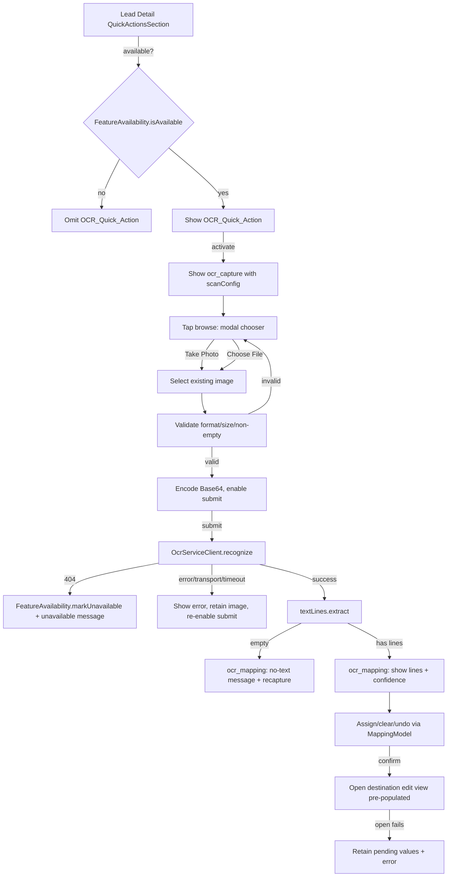
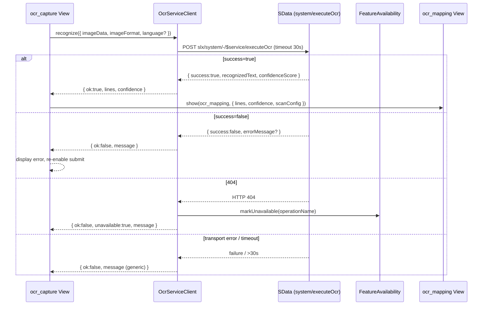
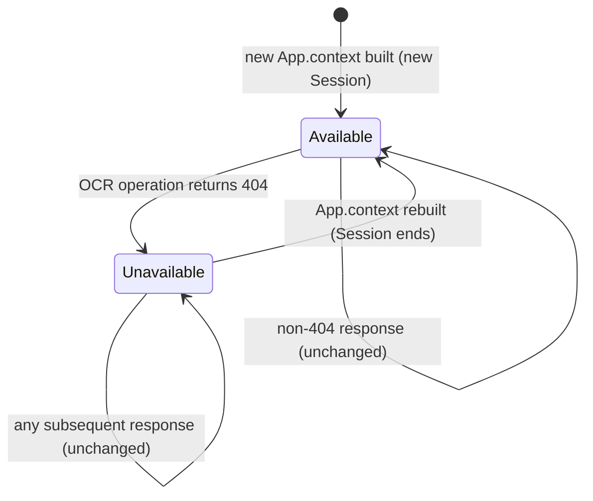

# Design Document

## Overview

The OCR Card Scanner adds optical character recognition to the argos-saleslogix mobile CRM. A user viewing a Lead can capture or upload an image, send it to the server-side SData OCR service operation (`POST slx/system/-/$service/executeOcr`), receive the recognized text as newline-separated lines, map each line onto Lead fields through a mapping screen with an undo stack, and land on the Lead edit view with the mapped values pre-populated.

The OCR engine itself is server-side and out of scope. This design covers only the mobile client (consumer) responsibilities described in the requirements: session-scoped feature availability detection on 404, the Lead quick action entry point, image capture/upload and validation, request construction and submission, success/error response handling, the text-to-field mapping UI with undo, and pre-population of the Lead edit view.

The design follows the repository's AMD module conventions (`crm/` prefix for argos-saleslogix modules), the `argos-sdk` view/mixin architecture (`_DetailBase`, `_EditBase`, `View`), Simplate templating, and the SData client request model. It explicitly factors entity-specific concerns out of the reusable components so Contacts and other entities can adopt scanning later without modifying the OCR client.

### Key Design Goals

1. **Reuse the established 404 pattern.** Availability detection reuses the session-scoped unsupported-operation map on `App.context` exactly as `crm/Views/Journey/CustomerJourney360Widget` does, so the OCR operation stops being re-requested for the rest of a session once a 404 is seen.
2. **Entity-agnostic core.** `OCR_Service_Client` and `OCR_Mapping_View` know nothing about Lead-specific field names. The Lead entry point supplies the target field set and destination edit view as configuration. Future entities supply their own.
3. **Pure, testable logic.** Text-line extraction, image validation, the mapping/undo model, and value truncation are implemented as pure functions/classes that are independent of the DOM and the network, so they can be exercised with property-based tests.

### Source Modules (new)

| Module ID | File | Responsibility |
|-----------|------|----------------|
| `crm/OCR/OcrServiceClient` | `products/argos-saleslogix/src/OCR/OcrServiceClient.js` | Build, send, interpret the OCR_Service_Operation request (entity-agnostic). |
| `crm/OCR/FeatureAvailability` | `products/argos-saleslogix/src/OCR/FeatureAvailability.js` | Session-scoped availability tracking on `App.context`. |
| `crm/OCR/textLines` | `products/argos-saleslogix/src/OCR/textLines.js` | Pure helpers: split/trim recognized text, clamp confidence. |
| `crm/OCR/imageValidation` | `products/argos-saleslogix/src/OCR/imageValidation.js` | Pure helpers: format detection, size/empty checks. |
| `crm/OCR/MappingModel` | `products/argos-saleslogix/src/OCR/MappingModel.js` | Pure mapping state + bounded undo stack. |
| `crm/Views/OCR/Capture` | `products/argos-saleslogix/src/Views/OCR/Capture.js` | Capture/upload, preview, validation surface, submit. |
| `crm/Views/OCR/Mapping` | `products/argos-saleslogix/src/Views/OCR/Mapping.js` | Map lines to fields, undo, confirm and navigate to edit. |

### Modified Modules

| Module ID | Change |
|-----------|--------|
| `crm/Views/Lead/Detail` | Add the `OCR_Quick_Action` to `QuickActionsSection`, conditionally rendered on availability; launch behavior. |
| `crm/ApplicationModule` | Register `ocr_capture` and `ocr_mapping` views (not exposed in navigation). |
| Localization (`leadDetail`, new `ocrCapture`, `ocrMapping`) | New strings, including the deferred `OCR_Quick_Action_Label`. |

> **Open question carried from requirements:** the final wording of `OCR_Quick_Action_Label` ("Scan" vs "Card Reader") is undecided. The design routes the label through a single localization key (`leadDetail.ocrScanText`) so the wording can be set in one place when confirmed.

## Architecture

### Component Responsibilities

- **`crm/Views/Lead/Detail` (entry point).** Adds an `OCR_Quick_Action` to the existing `QuickActionsSection`. The action's visibility is bound to `FeatureAvailability.isAvailable()`. On activation it shows `ocr_capture`, passing an entity-specific **scan configuration** (target field set + destination edit view id + Lead context). It does **not** request camera access up front — no `getUserMedia` probe — so the device camera never engages on activation (notably on desktop). Any camera permission prompt is deferred to the capture view, raised by the OS only when the user chooses the camera option.
- **`crm/OCR/FeatureAvailability`.** Thin wrapper over the `App.context.unsupportedOperations` map. Records the OCR operation name as unsupported on 404, reports availability, and is reset implicitly when `App.context` is rebuilt for a new session.
- **`crm/Views/OCR/Capture` (`ocr_capture`).** Provides a browse control that opens an SDK modal (`App.modal`) image-source chooser ("Take Photo" / "Choose File"). "Choose File" triggers a hidden upload input (`accept="image/*"`); "Take Photo" starts a live `getUserMedia` capture (webcam on desktop, camera on mobile), shows a video overlay, and grabs a frame to a canvas on capture. A hidden camera input (`capture="environment"`) is retained only as a fallback when `getUserMedia` is unavailable. The camera is only engaged on an explicit "Take Photo" choice. It renders a preview, validates the chosen/captured image (format, size, non-empty) using `imageValidation`, encodes Base64, manages the submit-enabled state and in-flight progress, calls `OcrServiceClient`, and routes success to `ocr_mapping` or shows error/timeout indications.
- **`crm/OCR/OcrServiceClient`.** Entity-agnostic. Builds the `SDataServiceOperationRequest` (`system` contract, `executeOcr` operation), enforces the 30-second timeout, classifies the response (success / error / 404 / transport failure), extracts `recognizedText` + `confidenceScore` or the substituted error message, and reports 404 to `FeatureAvailability`.
- **`crm/OCR/textLines`.** Pure: splits recognized text on newlines, trims, drops whitespace-only lines, preserves order; clamps confidence to `[0,100]`.
- **`crm/Views/OCR/Mapping` (`ocr_mapping`).** Accepts the scan configuration and the extracted `Text_Lines`. Drives a `MappingModel` to assign/clear pending values, enforces per-field max length, supports undo, displays confidence, and on confirm opens the destination edit view pre-populated.
- **`crm/OCR/MappingModel`.** Pure: holds the per-field pending values and the bounded (max 50) undo stack; applies and reverts `Mapping_Action`s; produces the final pending-value map for pre-population.

### High-Level Flow



### Request Sequence



### Availability State Machine



## Components and Interfaces

### `crm/OCR/FeatureAvailability`

Mirrors the `_getUnsupportedOperations` / `_isOperationUnsupported` / `_markOperationUnsupported` trio from `CustomerJourney360Widget`, extracted into a reusable module keyed by operation name. The map lives on `App.context.unsupportedOperations`, so it is shared for the session and discarded when the context is rebuilt.

```javascript
define('crm/OCR/FeatureAvailability', [], () => {
  const OCR_OPERATION_NAME = 'executeOcr';

  function getMap() {
    if (!App.context) { return {}; }
    if (!App.context.unsupportedOperations) {
      App.context.unsupportedOperations = {};
    }
    return App.context.unsupportedOperations;
  }

  return {
    operationName: OCR_OPERATION_NAME,
    // True unless a 404 has been recorded for the operation this session.
    isAvailable(operationName = OCR_OPERATION_NAME) {
      const map = App.context && App.context.unsupportedOperations;
      return !(map && map[operationName]);
    },
    // Records the operation as unavailable for the rest of the session.
    markUnavailable(operationName = OCR_OPERATION_NAME) {
      getMap()[operationName] = true;
    },
  };
});
```

- **Req 1.1/1.3/1.7:** `markUnavailable` sets the session map entry; `isAvailable` reads it; the map is the same `App.context.unsupportedOperations` used by the journey widget.
- **Req 1.2:** only `markUnavailable` mutates state, so non-404 responses leave it unchanged (the client only calls `markUnavailable` on 404).
- **Req 1.6:** because state lives on `App.context`, a rebuilt context starts with no entry, i.e. available.

### `crm/OCR/OcrServiceClient`

Entity-agnostic. Accepts only image input and returns a normalized result; never references Lead fields (Req 10.1).

```javascript
define('crm/OCR/OcrServiceClient', [
  './FeatureAvailability',
  './textLines',
], (FeatureAvailability, textLines) => {
  const TIMEOUT_MS = 30000;

  class OcrServiceClient {
    constructor({ service = App.getService(), availability = FeatureAvailability } = {}) {
      this.service = service;
      this.availability = availability;
    }

    // request: { imageData (Base64), imageFormat (declared format), language? }
    // returns Promise<OcrResult>
    recognize(request) { /* builds SDataServiceOperationRequest, enforces timeout, classifies */ }

    // Pure response interpretation, separated for testing.
    interpretResponse(raw) { /* -> OcrResult */ }
  }

  return OcrServiceClient;
});
```

Request construction (consistent with `SpeedSearchList` / `MFA/Service` and the journey widget's `request` envelope):

```javascript
const request = new Sage.SData.Client.SDataServiceOperationRequest(this.service)
  .setContractName('system')
  .setOperationName('executeOcr');

const entry = {
  request: {
    imageData,          // Base64 string             (Req 4.1)
    imageFormat,        // declared Supported_Image_Format (Req 4.1)
    ...(language ? { language } : {}), // included only when specified (Req 4.2 / 4.3)
  },
};
```

`OcrResult` (normalized, returned to the view):

```
{
  ok: boolean,            // success === true
  unavailable: boolean,   // HTTP 404 seen
  timedOut: boolean,      // exceeded 30s
  lines: string[],        // extracted Text_Lines (ok only)
  confidence: number,     // clamped 0..100 (ok only)
  message: string,        // error/unavailable text (non-ok)
}
```

Classification rules:
- `success === true` → extract `recognizedText`/`confidenceScore`, run `textLines.extract`, clamp confidence (Req 5.1, 5.2, 5.4).
- `success === false` → use `errorMessage` or substitute generic message (Req 6.1).
- HTTP 404 → `availability.markUnavailable()`, set `unavailable: true`, generic unavailable message (Req 1.1, 6.6).
- transport failure or >30s → `timedOut`/generic message (Req 4.5, 6.4, 6.5).

### `crm/OCR/textLines`

```javascript
define('crm/OCR/textLines', [], () => ({
  // Req 5.2: split on newlines, trim, drop whitespace-only lines, preserve order.
  extract(recognizedText) {
    if (typeof recognizedText !== 'string') { return []; }
    return recognizedText
      .split(/\r\n|\r|\n/)
      .map((line) => line.trim())
      .filter((line) => line.length > 0);
  },
  // Req 5.4: confidence bounded to 0..100.
  clampConfidence(value) {
    const n = Number(value);
    if (!Number.isFinite(n)) { return 0; }
    return Math.max(0, Math.min(100, n));
  },
}));
```

### `crm/OCR/imageValidation`

```javascript
define('crm/OCR/imageValidation', [], () => {
  const SUPPORTED = ['png', 'jpeg', 'tiff', 'bmp']; // JPG aliases JPEG
  const MAX_BYTES = 10 * 1024 * 1024; // Image_Size_Limit = 10 MB

  return {
    SUPPORTED_FORMATS: SUPPORTED,
    MAX_BYTES,
    // Req 3.8: normalize declared format; 'jpg' -> 'jpeg'.
    normalizeFormat(declared) { /* lowercases, maps jpg->jpeg, returns null if unknown */ },
    isSupportedFormat(declared) { /* Req 3.4 */ },
    isWithinSizeLimit(byteLength) { return byteLength <= MAX_BYTES; }, // Req 3.5
    isNonEmpty(byteLength) { return byteLength > 0; },                 // Req 3.6
    // Req 3.9: submit allowed only when all three hold.
    canSubmit({ declaredFormat, byteLength }) {
      return this.isSupportedFormat(declaredFormat)
        && this.isWithinSizeLimit(byteLength)
        && this.isNonEmpty(byteLength);
    },
  };
});
```

### `crm/OCR/MappingModel`

Pure model with no DOM/network coupling. Holds the per-field pending values and a bounded undo stack.

```javascript
define('crm/OCR/MappingModel', [], () => {
  const MAX_UNDO = 50;

  class MappingModel {
    constructor(targetFields) {
      this.fields = targetFields; // [{ name, property, maxTextLength }]
      this.pending = {};          // fieldName -> value
      this.undoStack = [];        // [{ fieldName, previousValue, nextValue }]
    }

    // Req 7.2/7.3/7.7/7.8 + Req 8.1/8.6: assign a line to a field.
    assign(fieldName, lineText) {
      const field = this._field(fieldName);
      if (lineText.length > field.maxTextLength) {
        return { ok: false, reason: 'maxLength' }; // Req 7.7: reject, keep existing
      }
      this._record(fieldName, this.pending[fieldName], lineText);
      this.pending[fieldName] = lineText;
      return { ok: true };
    }

    clear(fieldName) { /* Req 7.4: record action, delete pending value */ }

    // Req 8.2/8.3: revert most recent action.
    undo() { /* pops, restores previousValue, returns status */ }

    canUndo() { return this.undoStack.length > 0; } // Req 8.4

    // Req 9.2/9.3: pending values with at least one non-whitespace char.
    toPrepopulationMap() { /* { property: value } for non-empty trimmed values */ }

    _record(fieldName, previousValue, nextValue) {
      this.undoStack.push({ fieldName, previousValue, nextValue });
      if (this.undoStack.length > MAX_UNDO) {
        this.undoStack.shift(); // Req 8.6: drop oldest, never exceed 50
      }
    }
  }
  return MappingModel;
});
```

### `crm/Views/OCR/Capture` (`ocr_capture`)

Extends `argos/View`. Receives a **scan configuration** via `show(options)`:

```
options = {
  scanConfig: {
    targetFields: [{ name, label, property, maxTextLength }], // entity-supplied
    destinationEditView: 'lead_edit',                          // entity-supplied
    entityContext: { /* optional defaults forwarded to edit */ },
    language: 'en' | undefined,                                // optional token
  },
  entry: currentLead, // for back-navigation context only
}
```

Responsibilities and the requirements they satisfy:
- Browse control opens an `App.modal` chooser ("Take Photo" / "Choose File" / "Cancel"). "Choose File" triggers a hidden upload input (`accept="image/*"`, no `capture`); "Take Photo" starts a live `getUserMedia` capture that works on desktop webcams as well as mobile cameras, presenting a video overlay with capture/cancel controls and grabbing a frame to a canvas (encoded as PNG). A hidden camera input with `capture="environment"` is kept only as a fallback when `getUserMedia` is unavailable. The camera is engaged only on an explicit "Take Photo" choice, and the browser raises any camera permission prompt at that moment (Req 3.1, 3.11, 3.12, 2.6). When no modal facility is present the view falls back to the upload input.
- On selection: read file, determine declared format (Req 3.8), compute byte length, render preview within budget (Req 3.2), encode Base64 (Req 3.3).
- Validation gates using `imageValidation`: unsupported format (Req 3.4), oversize (Req 3.5), empty (Req 3.6); each shows a message and withholds submission, leaving the selection unchanged.
- Submit control disabled while no valid image (Req 3.7), enabled when valid (Req 3.9); cancel leaves prior state (Req 3.10).
- On submit: show progress, block resubmission of the same image (Req 4.4), call `OcrServiceClient.recognize`; withhold the request if no Base64/format (Req 4.7).
- Handle results: timeout (Req 4.5), error/transport (Req 4.6, 6.2, 6.4, 6.5), retry retaining the image (Req 6.3), 404 unavailable message (Req 6.6), success routes to `ocr_mapping` (Req 5.3) or no-text message with recapture (Req 5.5).

### `crm/Views/OCR/Mapping` (`ocr_mapping`)

Extends `argos/View`. Receives:

```
options = {
  lines: string[],         // extracted Text_Lines
  confidence: number,      // 0..100, omitted display when no lines
  scanConfig: { targetFields, destinationEditView, entityContext },
}
```

- Validates configuration on entry: missing `targetFields` or `destinationEditView` → reject, retain no state, return a configuration error naming the missing parameter (Req 10.2, 10.3).
- Presents target fields (Req 7.1) and the line list in original order (Req 5.3); shows confidence as a 0–100 percentage (Req 5.4) or the no-text message + recapture controls when `lines` is empty (Req 5.5).
- Recognized lines are rendered as editable inputs so a noisy line can be trimmed before mapping; each line also exposes a **Split** action that splits the line at the caret position into two lines (pressing Enter in the line does the same). Splitting at the cursor — rather than on every whitespace — gives precise control for multi-part lines like `1234 Elm St, Anytown, USA`. Focusing a line selects it for the next assignment; edits are kept in the line model and reflected in the pre-populated value.
- Undo is unified: mapping assigns/clears and line splits are recorded on a single in-view undo log, so the Undo control reverts whichever happened last (a split restores the original line; a mapping action delegates to `MappingModel`). The control is disabled when there is nothing to undo (Req 8.4).
- Delegates assign/clear/undo to `MappingModel`; reflects pending values within budget (Req 7.2, 7.4); disables undo when the stack is empty (Req 8.4); shows "nothing to undo" when requested on an empty stack (Req 8.7); shows max-length and undo-failure indications (Req 7.7, 8.8).
- On confirm: builds the pre-population entry from `MappingModel.toPrepopulationMap()`, truncating any value that exceeds its field max length and flagging truncation (Req 9.5), then opens `destinationEditView` (Req 9.1, 9.2, 9.3, 9.4). On open failure, retains pending values and shows an error (Req 9.6).

Pre-population uses the established insert navigation pattern (`view.show({ entry, insert: true }, { returnTo })`), where `entry` is the property→value map produced by the mapping model merged over `entityContext`. `_EditBase.processData` applies `options.entry` as non-modified data, so every pre-filled value stays editable (Req 9.4).

**History handling.** The OCR views are transient steps, so each forward transition is opened with `returnTo: -1`, which (per `View.open`) drops the source view from `App.context.history` as the next view is pushed: capture→mapping drops the capture view, mapping→edit drops the mapping view, and mapping→capture (recapture) drops the stale mapping view. The net effect is that only one OCR view is ever in the back stack, and once the user reaches the destination edit view, Back returns to the Lead detail rather than re-entering the capture or mapping screens.

## Data Models

### ScanConfiguration (caller-supplied, entity-agnostic seam)

```
ScanConfiguration {
  targetFields: TargetField[]   // required, non-empty
  destinationEditView: string   // required, registered view id (e.g. 'lead_edit')
  entityContext?: object        // optional defaults merged into the edit entry
  language?: string             // optional OCR language token
}

TargetField {
  name: string                  // logical field name / mapping key
  label: string                 // display label in the mapping view
  property: string              // edit-view entry property to pre-populate
                                //   (may be a dotted path, e.g. 'Address.City')
  maxTextLength: number         // per-field max length (from edit layout)
  group?: string                // optional group label (e.g. 'Address') for an
                                //   indented section in the mapping view
}
```

For Leads, the entry point derives the `TargetField[]` from the registered `lead_edit` view's `createLayout()` at activation time, including only field types whose value can be populated from a single recognized line (`name`, `text`, `phone`, `picklist`) and skipping composite/relational types (`address`, `lookup`) and large notes. Each entry carries `{ name, label, property, maxTextLength }` taken from the edit field (with a default max length for fields that declare none, e.g. `Email`). This keeps the mappable set in sync with the real edit form — including the lead name and email — rather than a hardcoded list (a static set remains only as a fallback when the layout cannot be read). A composite `address` field is expanded into individual, indented sub-fields (Address1/2, City, State, PostalCode, Country) sourced from its `address_edit` layout, each using a dotted property path (`Address.<sub>`) and a shared `group` label. On confirm, the mapping view expands dotted property paths into nested objects so the address arrives as `entry.Address = { City, PostalCode, ... }` in the shape the edit view expects (partial addresses are fine — the user completes them on the edit screen). The address child is built as a brand-new child: it is given `IsPrimary: true` and carries no key (`EntityId`/`$key` are stripped), so the SData provider's `OnCreate`/`OnBeforeInsert` generates the id and wires the parent foreign key. The composite `name` field is flagged (`nameField`) and, on confirm, its mapped value is split into `FirstName`/`LastName` parts (supporting both "First Last" and "Last, First"), since the displayed `LeadNameLastFirst` is a read-only formatted property. Future entities (Contacts) supply their own `destinationEditView`, with no change to `OcrServiceClient` (Req 10.4).

### OcrRequestBody (wire format)

```
{ request: { imageData: string /*Base64*/, imageFormat: string, language?: string } }
```

### OcrResponse (wire format, server)

```
{ success: boolean, recognizedText: string, confidence: number, errorMessage?: string }
```

> The client reads the score from `confidence`; the older `confidenceScore` name is still accepted as a fallback.

### OcrResult (normalized, client)

```
OcrResult {
  ok: boolean
  unavailable: boolean
  timedOut: boolean
  lines: string[]
  confidence: number    // 0..100
  message: string
}
```

### MappingState (in `MappingModel`)

```
MappingState {
  pending: { [fieldName]: string }              // <= 1 value per field (Req 7.5)
  undoStack: MappingAction[]                     // length <= 50 (Req 8.1, 8.6)
}

MappingAction {
  fieldName: string
  previousValue: string | undefined             // value before the action (Req 8.3)
  nextValue: string | undefined                 // assigned value, or undefined for clear
}
```

### Availability State (on `App.context`)

```
App.context.unsupportedOperations: { [operationName: string]: true }
```

Session-scoped; created lazily; discarded when `App.context` is rebuilt (Req 1.6, 1.7).

## Correctness Properties

*A property is a characteristic or behavior that should hold true across all valid executions of a system — essentially, a formal statement about what the system should do. Properties serve as the bridge between human-readable specifications and machine-verifiable correctness guarantees.*

These properties are derived from the prework classification. UI rendering, navigation, timing, and external-service branches were classified as examples/edge cases and are covered by the unit tests in the Testing Strategy rather than as properties. Redundant criteria were consolidated as noted in the prework reflection.

### Property 1: Availability round-trip on 404

*For any* operation name, after `FeatureAvailability.markUnavailable(name)` is called, `FeatureAvailability.isAvailable(name)` returns false for the remainder of the session.

**Validates: Requirements 1.1, 1.3, 1.7**

### Property 2: Non-404 responses leave availability unchanged

*For any* response whose status is not 404, interpreting it never marks the operation unavailable, so the availability map is identical before and after interpretation.

**Validates: Requirements 1.2**

### Property 3: New session context resets availability

*For any* sequence of prior `markUnavailable` calls, once `App.context` is rebuilt (a fresh unsupported-operation map), `FeatureAvailability.isAvailable(name)` returns true.

**Validates: Requirements 1.6**

### Property 4: Base64 encoding (reused utility)

Base64 encoding for the request reuses the existing `crm/Utility.base64ArrayBuffer` encoder (`ICRMCommonSDK.utility.base64ArrayBuffer`), the same path the attachment views use. Its correctness is already covered by the existing `Utility.spec` Base64 tests, so no new round-trip property is introduced for this feature.

**Validates: Requirements 3.3**

### Property 5: Image format normalization

*For any* declared format token that is a case variant or alias of a supported format (PNG, JPEG/JPG, TIFF, BMP), `normalizeFormat` returns the canonical token (with `jpg` mapped to `jpeg`), and returns null for any token outside the supported set.

**Validates: Requirements 3.8**

### Property 6: Submit-enable predicate

*For any* combination of declared format and decoded byte length, `canSubmit` returns true if and only if the format is supported AND the byte length is at most the 10 MB Image_Size_Limit AND the byte length is greater than zero.

**Validates: Requirements 3.4, 3.5, 3.6, 3.7, 3.9**

### Property 7: Request body construction

*For any* valid image input, the constructed request body sets `request.imageData` to the Base64 string and `request.imageFormat` to the declared supported format, and includes `request.language` if and only if a non-empty language token was supplied.

**Validates: Requirements 4.1, 4.2, 4.3**

### Property 8: Recognized-text line extraction

*For any* recognized-text string, `textLines.extract` produces an ordered collection in which every line is non-empty after trimming, no line contains only whitespace, and the lines appear in the same relative order as their source lines in the original text.

**Validates: Requirements 5.2**

### Property 9: Success-response classification

*For any* response with `success` set to true, interpretation yields `ok = true`, the extracted line collection from the recognized text, and a confidence value within the inclusive range 0 to 100.

**Validates: Requirements 5.1, 5.4**

### Property 10: Confidence clamping

*For any* confidence value in the response (including out-of-range or non-numeric values), the confidence reported to the mapping view is within the inclusive range 0 to 100.

**Validates: Requirements 5.4**

### Property 11: Error-message substitution

*For any* response with `success` set to false, the interpreted error message is non-empty: it equals the response `errorMessage` when that is present and non-empty, and equals the generic recognition-error message otherwise.

**Validates: Requirements 6.1**

### Property 12: 404 classification marks unavailable

*For any* 404 outcome from the OCR_Service_Operation, interpretation reports the result as unavailable and records the operation as unavailable through `FeatureAvailability`.

**Validates: Requirements 6.6, 1.1**

### Property 13: Assignment records pending value (last-write-wins)

*For any* target field and any line whose length is within the field's maximum, assigning the line sets that field's pending value to the line text; assigning a second valid line to the same field replaces the first, so the pending value equals the most recently assigned line.

**Validates: Requirements 7.2, 7.3**

### Property 14: Assign/clear round-trip

*For any* target field with an assigned pending value, clearing the field removes the pending value so the field is reported as having no pending value.

**Validates: Requirements 7.4**

### Property 15: At most one pending value per field

*For any* sequence of assign and clear actions, every target field has at most one pending value at all times, and fields that were never assigned have none.

**Validates: Requirements 7.5, 7.6**

### Property 16: Over-length assignment is rejected

*For any* target field and any line whose length exceeds the field's maximum, the assignment is rejected and the field's existing pending value is left unchanged.

**Validates: Requirements 7.7**

### Property 17: Field independence on shared lines

*For any* two distinct target fields and any line, assigning the line to the second field leaves the first field's pending value unchanged.

**Validates: Requirements 7.8**

### Property 18: Undo stack is bounded and LIFO

*For any* sequence of mapping actions, the undo stack never exceeds 50 entries; when an action is pushed onto a full stack, the oldest entry is dropped first; and each undo removes the most recently pushed action.

**Validates: Requirements 8.1, 8.2, 8.6**

### Property 19: Undo restores prior state (full unwind)

*For any* state and any sequence of mapping actions applied to it, undoing those actions (down to the relevant stack contents) restores each affected field to the pending value it held immediately before the action, and undoing every action on the stack restores the exact pending-value map that existed before any action was performed.

**Validates: Requirements 8.3, 8.5**

### Property 20: Pre-population map contains exactly the non-empty pending values

*For any* pending-value map, `toPrepopulationMap` produces an entry for a target field if and only if that field's pending value contains at least one non-whitespace character; included values are preserved, and fields that are unassigned or hold only whitespace are omitted (left at the edit-view default).

**Validates: Requirements 9.2, 9.3, 10.5**

### Property 21: Pre-population truncation

*For any* pending value and target field maximum length, the pre-populated value's length is at most the field maximum and equals the pending value truncated to that maximum.

**Validates: Requirements 9.5**

### Property 22: Required configuration rejection

*For any* invocation configuration missing the target field set, the destination edit view, or both, mapping initialization is rejected, no mapping state is retained, and the returned error names a missing required parameter.

**Validates: Requirements 10.3**

### Property 23: Parametric reuse across entities

*For any* target field set and any collection of lines, the mapping and pre-population behavior is determined solely by the supplied configuration (field names, properties, and maximum lengths), producing a pre-population map keyed by that configuration's properties — with no dependence on Lead-specific identifiers and no change to the OCR service client.

**Validates: Requirements 10.1, 10.4**

## Error Handling

Error handling is organized by the layer that detects the condition.

### Availability / platform support

- **404 from `executeOcr`:** `OcrServiceClient` calls `FeatureAvailability.markUnavailable()` and returns `{ ok: false, unavailable: true, message }`. The capture view shows the platform-unavailable message; the Lead detail view omits the quick action for the rest of the session (Req 1.1, 6.6, 2.4). This reuses the journey-widget map so the operation is not re-requested.

### Image selection / validation (capture view, before any network call)

- **Unsupported format / oversize / empty:** `imageValidation` returns false for the relevant check; the view shows the specific message, keeps submit disabled, and leaves the current selection unchanged (Req 3.4, 3.5, 3.6). No request is sent.
- **Submit attempted without valid data:** guarded by `canSubmit`; the request is withheld and a "valid image required" indication is shown (Req 4.7).

### Recognition request (network)

- **Timeout (>30s):** the request is terminated; the view retains the image, shows a timeout indication, and re-enables submission (Req 4.5). For Requirement 6.5 the same condition is also surfaced as a generic recognition error with retry.
- **Transport/network failure (non-404):** `{ ok: false, message: generic }`; the view shows a generic recognition error and allows retry retaining the image (Req 4.6, 6.3, 6.4).
- **`success: false` response:** error message extracted or substituted (Req 6.1) and displayed; retry allowed (Req 6.2, 6.3).
- **No text recognized (`success: true`, empty lines):** the mapping view shows a no-text message, omits confidence, and offers recapture/upload controls (Req 5.5).

### Mapping / pre-population

- **Over-length assignment:** rejected by `MappingModel.assign`; existing value retained; max-length indication shown (Req 7.7).
- **Undo on empty stack:** no field changes; "nothing to undo" indication; undo control disabled while the stack is empty (Req 8.4, 8.7).
- **Undo failure:** field and stack entry retained; "undo did not complete" indication (Req 8.8).
- **Missing required configuration:** mapping initialization rejects, retains no state, and returns an error naming the missing parameter (Req 10.3).
- **Confirm-time over-length value:** value truncated to the field maximum and a truncation indication is shown (Req 9.5).
- **Edit view fails to open:** pending values retained; error indication that the Lead edit screen could not be opened (Req 9.6).

### Entry-point (Lead detail)

- **Capture open failure:** message identifying the failure, a retry action, and the user kept on the Lead detail view with Lead data unchanged (Req 2.5).
- **Camera permission:** not requested at activation. The entry point opens the capture view without engaging the camera; any camera permission prompt is raised by the OS when the user chooses the camera option in the capture view's chooser (Req 2.6, 3.11, 3.12).

## Testing Strategy

The feature uses a dual approach: property-based tests for the pure logic modules and example/integration unit tests for views, navigation, timing, and external-service branches.

### Property-Based Tests

- **Library:** `fast-check` (already the workspace's property-based testing tool), run under the argos-saleslogix Mocha suite.
- **Scope:** the pure modules `crm/OCR/textLines`, `crm/OCR/imageValidation`, `crm/OCR/MappingModel`, the pure request-body builder and `interpretResponse` of `crm/OCR/OcrServiceClient`, the `toPrepopulationMap`/truncation helpers, and `crm/OCR/FeatureAvailability` (with a stubbed `App.context`).
- **Configuration:** each property test runs a minimum of 100 iterations (`fast-check` default `numRuns >= 100`).
- **Traceability:** each property test is tagged with a comment referencing the design property, in the format:
  `// Feature: ocr-card-scanner, Property {number}: {property_text}`
- **Coverage:** Properties 1–23 above. Generators must include edge inputs called out in the prework: empty strings, whitespace-only lines, mixed `\r\n`/`\r`/`\n` newlines, non-ASCII characters, zero-byte and exactly-10 MB images, format aliases/case variants, action sequences exceeding 50 to exercise the undo bound, and values exactly at/over field maximum lengths.

### Unit Tests (example / edge case)

- **Lead detail entry point:** action present when available (Req 1.5, 2.1), omitted when unavailable (Req 1.4, 2.3); activation opens capture with the scan config without requesting camera access (Req 2.2, 2.6); unavailable activation shows message without navigating (Req 2.4); capture open failure shows message + retry, Lead unchanged (Req 2.5).
- **Capture view:** browse control opens the image-source chooser with camera/upload/cancel choices, the camera input carries `capture` and the upload input does not, and the chooser triggers the chosen input (Req 3.1, 3.11, 3.12); preview rendered on selection (Req 3.2); cancel retains preview and submit state (Req 3.10); in-flight progress and resubmission block (Req 4.4); timeout/error branches re-enable submission and retain the image (Req 4.5, 4.6, 6.2, 6.4, 6.5); no-text message and recapture (Req 5.5).
- **Mapping view:** target fields rendered (Req 7.1); lines shown in order and mapping navigation (Req 5.3); undo control disabled when empty and "nothing to undo" message (Req 8.4, 8.7); undo-failure indication (Req 8.8); confirm opens the edit view (Req 9.1) with editable values (Req 9.4); edit-open failure retains pending values + error (Req 9.6).
- **Availability storage consistency:** `markUnavailable` writes `App.context.unsupportedOperations[name] = true`, matching the journey-widget location (Req 1.7).
- **Extensibility interface:** service client and mapping view exercised with a non-Lead configuration to confirm no entity-specific coupling (Req 10.1, 10.2).

### Integration / End-to-End (Playwright)

- A representative happy path (select supported image → recognize → map a line → confirm → Lead edit pre-populated) and a 404 path (quick action hidden for the session) provide 1–2 examples each. These verify wiring against the SData session and view registration rather than varying input, consistent with the prework's integration classification.

### Linting and Build

- New modules follow the AMD `crm/` module-ID convention and pass `npm run lint -w products/argos-saleslogix`.
- Tests run via `npm run test -w products/argos-saleslogix` (single run, not watch mode).
